```{=html}
<div class="hero">
  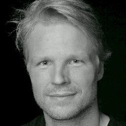
  <div class="hero-text">
    <p class="tagline">Machine learning research engineer, fascinated by the intersection of AI and science. I bridge scientific ML, biological domain knowledge, production-quality software, and team leadership.</p>
  </div>
</div>

<div class="hiring">
  <p class="hiring-status"><strong>Currently looking for Staff/Principal Research Engineer roles in AI for science</strong> (biology, proteomics, drug discovery, protein design, foundation models).</p>
  <div class="cta-buttons">
    <a class="cta cta-primary" href="files/jeroen-van-goey-cv.pdf" onclick="if(typeof gtag==='function'){gtag('event','cv_download',{file_name:'jeroen-van-goey-cv.pdf',link_text:'Download CV'});}"><i class="bi bi-file-earmark-arrow-down"></i> Download CV</a>
    <a class="cta cta-primary" href="mailto:jeroen.vangoey@gmail.com"><i class="bi bi-envelope"></i> Email me</a>
    <a class="cta" href="https://linkedin.com/in/jeroenvangoey"><i class="bi bi-linkedin"></i> LinkedIn</a>
    <a class="cta" href="https://scholar.google.com/citations?user=QinE3gcAAAAJ&hl=en"><i class="bi bi-mortarboard"></i> Google Scholar</a>
  </div>
  <ul class="proof">
    <li>Published InstaNovo (a transformer) and InstaNovo+ (a diffusion model) for <i>de novo</i> peptide sequencing in <strong>Nature Machine Intelligence</strong>.</li>
    <li>Lead BioAI teams working on peptide sequencing and signal-peptide design.</li>
    <li>Built and shipped production-grade ML systems across GPUs, HPC, cloud, and scientific data pipelines.</li>
  </ul>
</div>
```

## What I work on

I build and ship machine-learning systems for science. My main application is *de novo* peptide sequencing: generative models that read peptide sequences directly from raw mass spectra, the confidence estimation that makes those predictions trustworthy, and the proteome-scale analysis they feed.

```{=html}
<div class="framework">
  <div class="fw-label">Research framework</div>
  <div class="fw-stages">
    <div class="fw-stage">
      <div class="fw-top"><span class="fw-num">1</span><span class="fw-icon"><i class="bi bi-soundwave"></i></span></div>
      <div class="fw-flow">Spectrum <span class="fw-arrow">&rarr;</span> Peptide</div>
      <div class="fw-sub"><i>De novo</i> sequencing with transformer & diffusion models (<a class="fw-cite" href="#pub-instanovo">InstaNovo / InstaNovo+</a>)</div>
    </div>
    <div class="fw-connector"><i class="bi bi-chevron-right"></i></div>
    <div class="fw-stage">
      <div class="fw-top"><span class="fw-num">2</span><span class="fw-icon"><i class="bi bi-shield-check"></i></span></div>
      <div class="fw-flow">Peptide <span class="fw-arrow fw-arrow-refine" title="confidence scored on the peptide">&#8635;</span> Confidence</div>
      <div class="fw-sub">False-discovery-rate control, rescoring and calibration using PyTorch (<a class="fw-cite" href="#pub-winnow">Winnow</a>)</div>
    </div>
    <div class="fw-connector"><i class="bi bi-chevron-right"></i></div>
    <div class="fw-stage">
      <div class="fw-top"><span class="fw-num">3</span><span class="fw-icon"><i class="bi bi-diagram-3"></i></span></div>
      <div class="fw-flow">Peptides <span class="fw-arrow">&rarr;</span> Proteome</div>
      <div class="fw-sub">From quantification &amp; de Bruijn graph assembly to biological insight (<a class="fw-cite" href="#pub-instanexus">InstaNexus</a>)</div>
    </div>
  </div>
  <div class="fw-foot">Generative sequence models and scalable ML, from raw spectra to biology</div>
</div>

<ul class="proof">
  <li><strong>Independently validated:</strong> top-ranked across an external benchmark of 17 <i>de novo</i> sequencing tools on 83 datasets.</li>
  <li><strong>Built for scale:</strong> distributed training on large public datasets (~63 million spectra) curated with automated LLM labelling.</li>
</ul>
```


## Publications

8 publications, including in *Nature Machine Intelligence*.

```{=html}
<p class="pub-metrics"><!-- OPENALEX:START --><strong>91</strong> citations &middot; <span class="h-index-term" tabindex="0" role="note" aria-label="If you have an h-index of 5, it means you have published at least 5 papers that have each received 5 or more citations" data-tip="If you have an h-index of 5, it means you have published at least 5 papers that have each received 5 or more citations">h-index</span> <strong>5</strong> &middot; <span class="h-index-term" tabindex="0" role="note" aria-label="If you have an i10-index of 4, it means you have published 4 papers that have each received 10 or more citations" data-tip="If you have an i10-index of 4, it means you have published 4 papers that have each received 10 or more citations">i10</span> <strong>4</strong> &middot; <span style="color:#888;font-size:.8rem">via OpenAlex, Jun 2026</span><!-- OPENALEX:END --></p>
```

```{=html}
<p class="author-legend"><span class="author-role">*</span> co-first author · <span class="author-role">†</span> co-senior author</p>

<div class="pub-list">

<div class="pub-card flagship" id="pub-instanovo">
  <a class="pub-thumb" href="https://doi.org/10.1038/s42256-025-01019-5">
    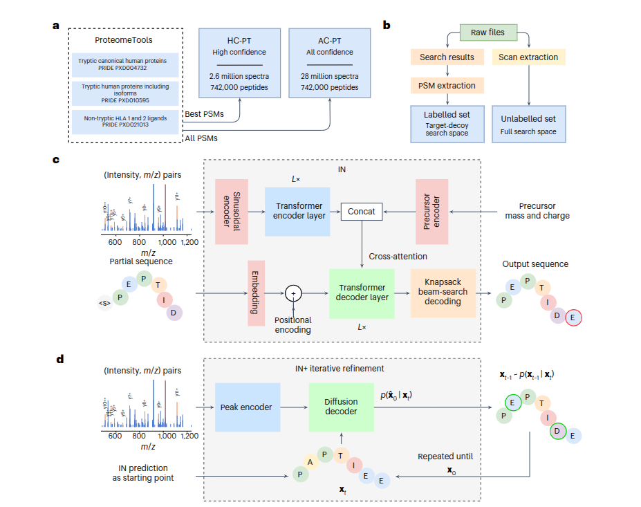
  </a>
  <div class="pub-body">
    <div class="pub-title"><a href="https://doi.org/10.1038/s42256-025-01019-5">InstaNovo enables diffusion-powered <i>de novo</i> peptide sequencing in large-scale proteomics experiments</a></div>
    <div class="pub-authors">K. Eloff*, K. Kalogeropoulos*, <span class="author-ellipsis" role="button" tabindex="0" aria-expanded="false" aria-label="Full author list: K. Eloff*, K. Kalogeropoulos*, A. Mabona, O. Morell, R. Catzel, E. Rivera-de-Torre, J. Berg Jespersen, W. Williams, S. P. B. van Beljouw, M. J. Skwark, A. H. Laustsen, S. J. J. Brouns, A. Ljungars, E. M. Schoof, J. Van Goey, U. auf dem Keller, K. Beguir, N. Lopez Carranza, T. P. Jenkins" data-authors="K. Eloff*, K. Kalogeropoulos*, A. Mabona, O. Morell, R. Catzel, E. Rivera-de-Torre, J. Berg Jespersen, W. Williams, S. P. B. van Beljouw, M. J. Skwark, A. H. Laustsen, S. J. J. Brouns, A. Ljungars, E. M. Schoof, J. Van Goey, U. auf dem Keller, K. Beguir, N. Lopez Carranza, T. P. Jenkins">...</span> <strong>J. Van Goey</strong>, <span class="author-ellipsis" role="button" tabindex="0" aria-expanded="false" aria-label="Full author list: K. Eloff*, K. Kalogeropoulos*, A. Mabona, O. Morell, R. Catzel, E. Rivera-de-Torre, J. Berg Jespersen, W. Williams, S. P. B. van Beljouw, M. J. Skwark, A. H. Laustsen, S. J. J. Brouns, A. Ljungars, E. M. Schoof, J. Van Goey, U. auf dem Keller, K. Beguir, N. Lopez Carranza, T. P. Jenkins" data-authors="K. Eloff*, K. Kalogeropoulos*, A. Mabona, O. Morell, R. Catzel, E. Rivera-de-Torre, J. Berg Jespersen, W. Williams, S. P. B. van Beljouw, M. J. Skwark, A. H. Laustsen, S. J. J. Brouns, A. Ljungars, E. M. Schoof, J. Van Goey, U. auf dem Keller, K. Beguir, N. Lopez Carranza, T. P. Jenkins">...</span> T. P. Jenkins</div>
    <div class="pub-venue"><span class="venue-name">Nature Machine Intelligence</span> · 2025 · 7(4):565–579</div>
    <div class="pub-badges">
      <a class="badge-primary" href="https://doi.org/10.1038/s42256-025-01019-5"><i class="bi bi-journal-text"></i> Nature Mach. Intell.</a>
      <a href="https://github.com/instadeepai/InstaNovo"><i class="bi bi-github"></i> Code (123 <i class="bi bi-star-fill"></i>)</a>
      <a href="https://deepchain.bio/sequence-peptideswithout-reference-databases/"><i class="bi bi-box-seam"></i> Commercial hosting (DeepChain)</a>
      <a href="https://instadeepai.github.io/InstaNovo/"><i class="bi bi-book"></i> Docs</a>
      <a href="https://huggingface.co/spaces/InstaDeepAI/InstaNovo"><i class="bi bi-play-circle"></i> Demo</a>
      <a href="https://huggingface.co/datasets/InstaDeepAI/ms_proteometools"><i class="bi bi-database"></i> Datasets</a>
      <a href="https://instanovo.ai/blog/"><i class="bi bi-rss"></i> Blog</a>
      <a href="files/bib/eloff2025instanovo.bib" download><i class="bi bi-quote"></i> BibTeX</a>
      <a href="#instanovo-in-the-news"><i class="bi bi-newspaper"></i> In the news</a>
    </div>
  </div>
</div>

<div class="pub-card">
  <a class="pub-thumb" href="https://doi.org/10.1101/2025.05.14.654049">
    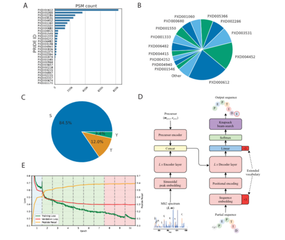
  </a>
  <div class="pub-body">
    <div class="pub-title"><a href="https://doi.org/10.1101/2025.05.14.654049">InstaNovo-P: a <i>de novo</i> peptide sequencing model for phosphoproteomics</a></div>
    <div class="pub-authors">J. Lauridsen*, P. Ramasamy*, <span class="author-ellipsis" role="button" tabindex="0" aria-expanded="false" aria-label="Full author list: J. Lauridsen*, P. Ramasamy*, R. Catzel, V. Canbay, A. Mabona, K. Eloff, P. Fullwood, J. Ferguson, A. Kirketerp-Møller, I. S. Goldschmidt, T. Claeys, S. van Puyenbroeck, N. Lopez Carranza, E. M. Schoof, L. Martens, J. Van Goey, C. Francavilla, T. P. Jenkins†, K. Kalogeropoulos†" data-authors="J. Lauridsen*, P. Ramasamy*, R. Catzel, V. Canbay, A. Mabona, K. Eloff, P. Fullwood, J. Ferguson, A. Kirketerp-Møller, I. S. Goldschmidt, T. Claeys, S. van Puyenbroeck, N. Lopez Carranza, E. M. Schoof, L. Martens, J. Van Goey, C. Francavilla, T. P. Jenkins†, K. Kalogeropoulos†">...</span> <strong>J. Van Goey</strong>, <span class="author-ellipsis" role="button" tabindex="0" aria-expanded="false" aria-label="Full author list: J. Lauridsen*, P. Ramasamy*, R. Catzel, V. Canbay, A. Mabona, K. Eloff, P. Fullwood, J. Ferguson, A. Kirketerp-Møller, I. S. Goldschmidt, T. Claeys, S. van Puyenbroeck, N. Lopez Carranza, E. M. Schoof, L. Martens, J. Van Goey, C. Francavilla, T. P. Jenkins†, K. Kalogeropoulos†" data-authors="J. Lauridsen*, P. Ramasamy*, R. Catzel, V. Canbay, A. Mabona, K. Eloff, P. Fullwood, J. Ferguson, A. Kirketerp-Møller, I. S. Goldschmidt, T. Claeys, S. van Puyenbroeck, N. Lopez Carranza, E. M. Schoof, L. Martens, J. Van Goey, C. Francavilla, T. P. Jenkins†, K. Kalogeropoulos†">...</span> K. Kalogeropoulos†</div>
    <div class="pub-venue"><span class="venue-name">bioRxiv</span> (preprint) · 2025</div>
    <div class="pub-badges">
      <a class="badge-primary" href="https://doi.org/10.1101/2025.05.14.654049"><i class="bi bi-file-earmark-text"></i> bioRxiv</a>
      <a href="https://github.com/instadeepai/InstaNovo-P"><i class="bi bi-github"></i> Code</a>
      <a href="https://huggingface.co/datasets/InstaDeepAI/InstaNovo-P"><i class="bi bi-database"></i> Datasets</a>
      <a href="files/bib/lauridsen2025instanovo.bib" download><i class="bi bi-quote"></i> BibTeX</a>
    </div>
  </div>
</div>

<div class="pub-card" id="pub-winnow">
  <a class="pub-thumb" href="https://arxiv.org/abs/2509.24952">
    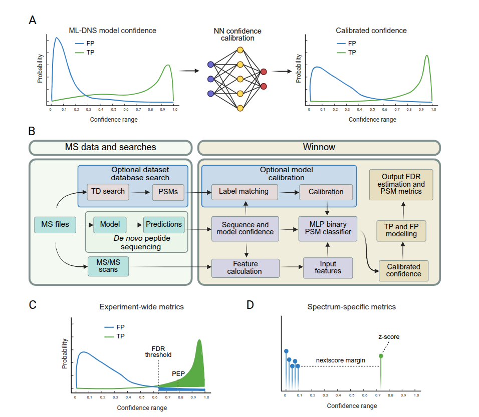
  </a>
  <div class="pub-body">
    <div class="pub-title"><a href="https://arxiv.org/abs/2509.24952"><i>De novo</i> peptide sequencing rescoring and FDR estimation with Winnow</a></div>
    <div class="pub-authors">A. Mabona*, J. Daniel*, <span class="author-ellipsis" role="button" tabindex="0" aria-expanded="false" aria-label="Full author list: A. Mabona*, J. Daniel*, H. S. J. Knudsen, R. Catzel, K. M. Eloff, E. M. Schoof, N. Lopez Carranza, T. P. Jenkins, J. Van Goey†, K. Kalogeropoulos†" data-authors="A. Mabona*, J. Daniel*, H. S. J. Knudsen, R. Catzel, K. M. Eloff, E. M. Schoof, N. Lopez Carranza, T. P. Jenkins, J. Van Goey†, K. Kalogeropoulos†">...</span> <strong>J. Van Goey</strong><span class="author-role" aria-label="co-senior author" title="co-senior author">†</span>, K. Kalogeropoulos<span class="author-role" aria-label="co-senior author" title="co-senior author">†</span></div>
    <div class="pub-venue"><span class="venue-name">arXiv</span> (preprint) · 2025</div>
    <div class="pub-badges">
      <a class="badge-primary" href="https://arxiv.org/abs/2509.24952"><i class="bi bi-file-earmark-text"></i> arXiv</a>
      <a href="https://github.com/instadeepai/winnow"><i class="bi bi-github"></i> Code</a>
      <a href="https://instadeepai.github.io/winnow/"><i class="bi bi-book"></i> Docs</a>
      <a href="https://huggingface.co/datasets/InstaDeepAI/winnow-ms-datasets"><i class="bi bi-database"></i> Datasets</a>
      <a href="files/bib/mabona2025novo.bib" download><i class="bi bi-quote"></i> BibTeX</a>
    </div>
  </div>
</div>

<div class="pub-card">
  <a class="pub-thumb" href="https://springernature.figshare.com/articles/journal_contribution/_b_A_living_proteomics_benchmark_for_comprehensive_b_b_evaluation_of_deep_learning-based_b_b_i_de_novo_i_b_b_peptide_b_b_sequencing_tools_b_/31680883/1">
    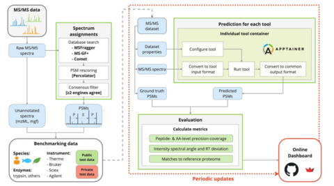
  </a>
  <div class="pub-body">
    <div class="pub-title"><a href="https://springernature.figshare.com/articles/journal_contribution/_b_A_living_proteomics_benchmark_for_comprehensive_b_b_evaluation_of_deep_learning-based_b_b_i_de_novo_i_b_b_peptide_b_b_sequencing_tools_b_/31680883/1">A living proteomics benchmark for comprehensive evaluation of deep learning-based <i>de novo</i> peptide sequencing tools</a></div>
    <div class="pub-authors">M. Pominova, <strong>J. Van Goey</strong>, <span class="author-ellipsis" role="button" tabindex="0" aria-expanded="false" aria-label="Full author list: M. Pominova, J. Van Goey, C. Adams, C. Dens, S. Chen, G. Deflandre, W. E. Fondrie, C. Ge, Z. Jin, D. Klaproth-Andrade, K. Kalogeropoulos, J. Lapin, T. Ling, K. Liu, Q. Liu, Z. Luan, A. Nilsson, C. Nix, Y. Sun, T. Van Den Bossche, R. Wu, J. Xia, Q. Xiao, S. Yang, T. Yang, C. Yao, M. Yilmaz, D. Zhang, X. Zhang, J. Zhou, C. Chang, S. Chang, E. Chuangsuwanich, J. Gagneur, L. Gatto, T. Guo, L. Käll, M. Li, S. Z. Li, B. A. Neely, M. R. Shortreed, S. Sriswasdi, B. Shan, S. Sun, H. Tang, H. Wang, Y. Wang, M. Wilhelm, L. Xin, B. Ma, W. S. Noble, T. P. Jenkins, W. Bittremieux" data-authors="M. Pominova, J. Van Goey, C. Adams, C. Dens, S. Chen, G. Deflandre, W. E. Fondrie, C. Ge, Z. Jin, D. Klaproth-Andrade, K. Kalogeropoulos, J. Lapin, T. Ling, K. Liu, Q. Liu, Z. Luan, A. Nilsson, C. Nix, Y. Sun, T. Van Den Bossche, R. Wu, J. Xia, Q. Xiao, S. Yang, T. Yang, C. Yao, M. Yilmaz, D. Zhang, X. Zhang, J. Zhou, C. Chang, S. Chang, E. Chuangsuwanich, J. Gagneur, L. Gatto, T. Guo, L. Käll, M. Li, S. Z. Li, B. A. Neely, M. R. Shortreed, S. Sriswasdi, B. Shan, S. Sun, H. Tang, H. Wang, Y. Wang, M. Wilhelm, L. Xin, B. Ma, W. S. Noble, T. P. Jenkins, W. Bittremieux">...</span> W. Bittremieux</div>
    <div class="pub-venue"><span class="venue-name">Registered report</span> (preprint) · 2026</div>
    <div class="pub-badges">
      <a class="badge-primary" href="https://springernature.figshare.com/articles/journal_contribution/_b_A_living_proteomics_benchmark_for_comprehensive_b_b_evaluation_of_deep_learning-based_b_b_i_de_novo_i_b_b_peptide_b_b_sequencing_tools_b_/31680883/1"><i class="bi bi-file-earmark-text"></i> Registered report</a>
      <a href="https://github.com/bittremieuxlab/denovo_benchmarks"><i class="bi bi-github"></i> Code</a>
      <a href="https://denovobenchmarks.streamlit.app/"><i class="bi bi-graph-up"></i> Live results</a>
      <a href="files/bib/pominova2026benchmark.bib" download><i class="bi bi-quote"></i> BibTeX</a>
    </div>
  </div>
</div>

<div class="pub-card" id="pub-instanexus">
  <a class="pub-thumb" href="https://doi.org/10.1016/j.mcpro.2026.101547">
    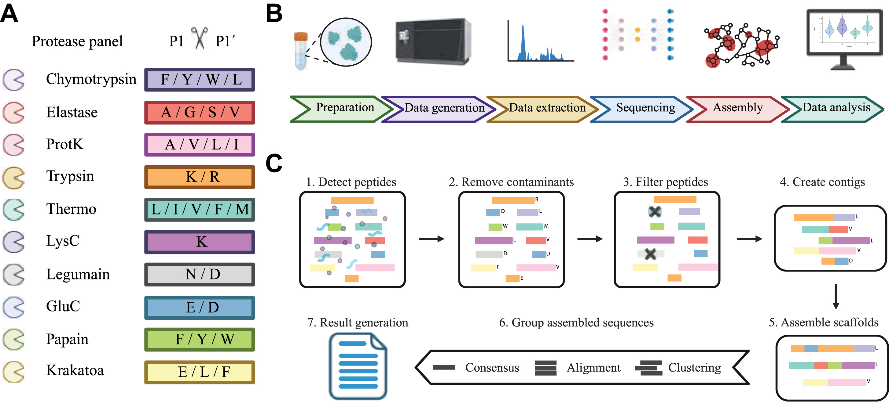
  </a>
  <div class="pub-body">
    <div class="pub-title"><a href="https://doi.org/10.1016/j.mcpro.2026.101547">Generalizable direct protein sequencing with InstaNexus</a></div>
    <div class="pub-authors">M. Reverenna, M. Wennekers Nielsen, <span class="author-ellipsis" role="button" tabindex="0" aria-expanded="false" aria-label="Full author list: M. Reverenna, M. Wennekers Nielsen, D. S. Wolff, J. Daniel, E. Lytra, S. Thumtecho, P. D. Colaianni, A. Ljungars, A. H. Laustsen, E. M. Schoof, J. Van Goey, T. P. Jenkins, M. V. Lukassen, A. Santos†, K. Kalogeropoulos†" data-authors="M. Reverenna, M. Wennekers Nielsen, D. S. Wolff, J. Daniel, E. Lytra, S. Thumtecho, P. D. Colaianni, A. Ljungars, A. H. Laustsen, E. M. Schoof, J. Van Goey, T. P. Jenkins, M. V. Lukassen, A. Santos†, K. Kalogeropoulos†">...</span> <strong>J. Van Goey</strong>, <span class="author-ellipsis" role="button" tabindex="0" aria-expanded="false" aria-label="Full author list: M. Reverenna, M. Wennekers Nielsen, D. S. Wolff, J. Daniel, E. Lytra, S. Thumtecho, P. D. Colaianni, A. Ljungars, A. H. Laustsen, E. M. Schoof, J. Van Goey, T. P. Jenkins, M. V. Lukassen, A. Santos†, K. Kalogeropoulos†" data-authors="M. Reverenna, M. Wennekers Nielsen, D. S. Wolff, J. Daniel, E. Lytra, S. Thumtecho, P. D. Colaianni, A. Ljungars, A. H. Laustsen, E. M. Schoof, J. Van Goey, T. P. Jenkins, M. V. Lukassen, A. Santos†, K. Kalogeropoulos†">...</span> K. Kalogeropoulos†</div>
    <div class="pub-venue"><span class="venue-name">Molecular &amp; Cellular Proteomics</span> · 2026 · 25(4):101547</div>
    <div class="pub-badges">
      <a class="badge-primary" href="https://doi.org/10.1016/j.mcpro.2026.101547"><i class="bi bi-journal-text"></i> Mol. Cell. Proteomics</a>
      <a href="https://github.com/Multiomics-Analytics-Group/InstaNexus"><i class="bi bi-github"></i> Code</a>
      <a href="files/bib/reverenna2026generalizable.bib" download><i class="bi bi-quote"></i> BibTeX</a>
    </div>
  </div>
</div>

</div>
```

```{=html}
<script>
document.addEventListener("DOMContentLoaded", () => {
  document.querySelectorAll(".pub-authors").forEach((row) => {
    const toggles = Array.from(row.querySelectorAll(".author-ellipsis"));
    toggles.forEach((toggle, index) => {
      const authors = toggle.dataset.authors.split(", ");
      const jeroen = authors.findIndex((author) => author.includes("J. Van Goey"));
      const last = authors.length - 1;
      const isOnlyToggle = toggles.length === 1;
      const isAfterJeroen = isOnlyToggle ? jeroen <= 1 : index > 0;
      const start = isAfterJeroen ? jeroen + 1 : 2;
      const end = isAfterJeroen ? last : jeroen;
      const omitted = authors.slice(start, end).join(", ");
      const expandedText = omitted ? `${omitted},` : "...";

      toggle.setAttribute("aria-label", `Show omitted authors: ${omitted}`);
      toggle.addEventListener("click", () => {
        const expanded = toggle.getAttribute("aria-expanded") === "true";
        toggle.textContent = expanded ? "..." : expandedText;
        toggle.setAttribute("aria-expanded", String(!expanded));
        toggle.setAttribute(
          "aria-label",
          expanded ? `Show omitted authors: ${omitted}` : "Collapse omitted authors"
        );
      });
      toggle.addEventListener("keydown", (event) => {
        if (event.key === "Enter" || event.key === " ") {
          event.preventDefault();
          toggle.click();
        }
      });
    });
  });
});
</script>
```

::: {.callout-note collapse="true" title="More publications"}

```{=html}
<div class="pub-list">

<div class="pub-card">
  <a class="pub-thumb" href="https://doi.org/10.1021/acs.jproteome.5c01153">
    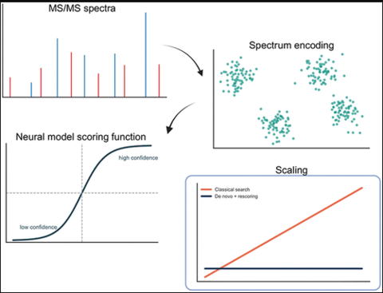
  </a>
  <div class="pub-body">
    <div class="pub-title"><a href="https://doi.org/10.1021/acs.jproteome.5c01153">A framework for database search with AI models in mass spectrometry-based proteomics</a></div>
    <div class="pub-authors">K. Kalogeropoulos, <strong>J. Van Goey</strong>, T. P. Jenkins, K. M. Eloff</div>
    <div class="pub-venue"><span class="venue-name">Journal of Proteome Research</span> · 2026 · 25(5):2234–2242</div>
    <div class="pub-badges">
      <a class="badge-primary" href="https://doi.org/10.1021/acs.jproteome.5c01153"><i class="bi bi-journal-text"></i> J. Proteome Res.</a>
      <a href="https://github.com/instadeepai/database_search_scaling"><i class="bi bi-github"></i> Code</a>
      <a href="files/bib/kalogeropoulos2026framework.bib" download><i class="bi bi-quote"></i> BibTeX</a>
    </div>
  </div>
</div>

<div class="pub-card">
  <a class="pub-thumb" href="https://doi.org/10.1021/acs.jproteome.4c01079">
    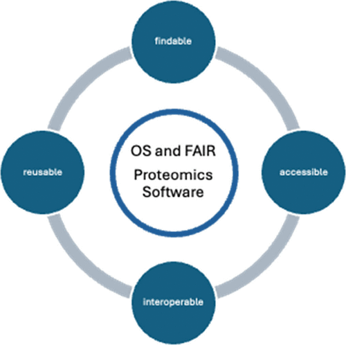
  </a>
  <div class="pub-body">
    <div class="pub-title"><a href="https://doi.org/10.1021/acs.jproteome.4c01079">Open-source and FAIR research software for proteomics</a></div>
    <div class="pub-authors">Y. Perez-Riverol, W. Bittremieux, <span class="author-ellipsis" role="button" tabindex="0" aria-expanded="false" aria-label="Full author list: Y. Perez-Riverol, W. Bittremieux, W. S. Noble, L. Martens, A. Bilbao, M. R. Lazear, B. Grüning, D. S. Katz, M. J. MacCoss, C. Dai, J. K. Eng, R. Bouwmeester, M. R. Shortreed, E. Audain, T. Sachsenberg, J. Van Goey, G. Wallmann, B. Wen, L. Käll, W. E. Fondrie" data-authors="Y. Perez-Riverol, W. Bittremieux, W. S. Noble, L. Martens, A. Bilbao, M. R. Lazear, B. Grüning, D. S. Katz, M. J. MacCoss, C. Dai, J. K. Eng, R. Bouwmeester, M. R. Shortreed, E. Audain, T. Sachsenberg, J. Van Goey, G. Wallmann, B. Wen, L. Käll, W. E. Fondrie">...</span> <strong>J. Van Goey</strong>, <span class="author-ellipsis" role="button" tabindex="0" aria-expanded="false" aria-label="Full author list: Y. Perez-Riverol, W. Bittremieux, W. S. Noble, L. Martens, A. Bilbao, M. R. Lazear, B. Grüning, D. S. Katz, M. J. MacCoss, C. Dai, J. K. Eng, R. Bouwmeester, M. R. Shortreed, E. Audain, T. Sachsenberg, J. Van Goey, G. Wallmann, B. Wen, L. Käll, W. E. Fondrie" data-authors="Y. Perez-Riverol, W. Bittremieux, W. S. Noble, L. Martens, A. Bilbao, M. R. Lazear, B. Grüning, D. S. Katz, M. J. MacCoss, C. Dai, J. K. Eng, R. Bouwmeester, M. R. Shortreed, E. Audain, T. Sachsenberg, J. Van Goey, G. Wallmann, B. Wen, L. Käll, W. E. Fondrie">...</span> W. E. Fondrie</div>
    <div class="pub-venue"><span class="venue-name">Journal of Proteome Research</span> · 2025 · 24(5):2222–2234</div>
    <div class="pub-badges">
      <a class="badge-primary" href="https://doi.org/10.1021/acs.jproteome.4c01079"><i class="bi bi-journal-text"></i> J. Proteome Res.</a>
      <a href="files/bib/perez2025open.bib" download><i class="bi bi-quote"></i> BibTeX</a>
    </div>
  </div>
</div>

<div class="pub-card">
  <a class="pub-thumb" href="files/poster_afkSNP.pdf">
    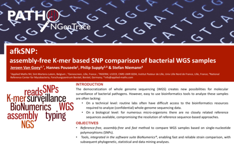
  </a>
  <div class="pub-body">
    <div class="pub-title"><a href="files/poster_afkSNP.pdf">afkSNP: assembly-free k-mer based SNP comparison of bacterial WGS samples</a></div>
    <div class="pub-authors"><strong>J. Van Goey</strong>, H. Pouseele, P. Supply, S. Niemann</div>
    <div class="pub-venue">Conference poster · Benelux Bioinformatics Conference 2015</div>
    <div class="pub-badges">
      <a class="badge-primary" href="files/poster_afkSNP.pdf"><i class="bi bi-file-earmark-pdf"></i> Poster (PDF)</a>
      <a href="https://www.researchgate.net/publication/291354610"><i class="bi bi-link-45deg"></i> ResearchGate</a>
      <a href="files/bib/vanafksnp.bib" download><i class="bi bi-quote"></i> BibTeX</a>
    </div>
  </div>
</div>

</div>
```

:::

### InstaNovo in the news {#instanovo-in-the-news}

The InstaNovo paper drew broad attention across the scientific press.

```{=html}
<div class="media-wrap">
  <div class="altmetric-box">
    <div data-badge-type="donut" data-badge-popover="right" data-doi="10.1038/s42256-025-01019-5" class="altmetric-embed"></div>
    <div class="altmetric-caption">Live Altmetric attention</div>
  </div>
  <div class="coverage">
    <strong>Selected coverage</strong>
    <ul class="coverage-grid">
      <li class="coverage-featured"><a href="https://www.science.org/content/article/ai-revolution-comes-protein-sequencing"><span class="headline">An AI revolution comes to protein sequencing</span></a></li>
      <li><a href="https://www.sciencenews.org/article/ai-decode-indecipherable-proteins"><span class="outlet">Science News</span><span class="headline">AI may help decode proteins DNA can't reveal</span></a></li>
      <li><a href="https://www.chemistryworld.com/news/ai-takes-step-towards-cracking-biologys-toughest-problem-protein-sequencing/4021205.article"><span class="outlet">Chemistry World</span><span class="headline">AI takes step towards cracking biology's toughest problem</span></a></li>
      <li><a href="https://www.biotechniques.com/computational-biology/doubling-up-novel-ai-models-improve-de-novo-peptide-sequencing/"><span class="outlet">BioTechniques</span><span class="headline">Doubling up: novel AI models improve <i>de novo</i> peptide sequencing</span></a></li>
      <li><a href="https://www.technologynetworks.com/tn/news/ai-models-accelerate-discovery-within-protein-science-397916"><span class="outlet">Technology Networks</span><span class="headline">AI models accelerate discovery within protein science</span></a></li>
      <li><a href="https://www.azolifesciences.com/news/20250401/Novel-AI-Models-Enhance-Disease-Diagnosis-and-Pathogen-Identification.aspx"><span class="outlet">AZoLifeSciences</span><span class="headline">Novel AI models enhance disease diagnosis and pathogen ID</span></a></li>
      <li><a href="https://www.sciencedaily.com/releases/2025/03/250331122207.htm"><span class="outlet">ScienceDaily</span><span class="headline">Possible game-changers within protein science and healthcare</span></a></li>
      <li><a href="https://www.miragenews.com/ai-models-revolutionize-protein-science-"><span class="outlet">Mirage News</span><span class="headline">AI models revolutionize protein science</span></a></li>
      <li><a href="https://www.theresearchcode.com/articles/ai-system-reads-protein-sequences-without-databases"><span class="outlet">The Research Code</span><span class="headline">AI system reads protein sequences without databases</span></a></li>
      <li><a href="https://www.dongascience.com/news.php?idx=70867"><span class="outlet">Dong-a Science</span><span class="headline">AI cracks protein sequencing (Korean)</span></a></li>
    </ul>
  </div>
</div>

<details class="more-coverage">
  <summary>More coverage: follow-up, press releases, blogs &amp; social</summary>
  <p><strong>Institutional press releases:</strong>
    <a href="https://instadeep.com/2025/03/enhancing-peptide-sequencing-with-ai/">InstaDeep</a> ·
    <a href="https://www.dtu.dk/english/newsarchive/2025/03/new-ai-models-possible-game-changers-within-protein-science-and-healthcare">DTU</a> ·
    <a href="https://www.sciencenews.dk/en/artificial-intelligence-cracks-protein-secrets-your-dna-cannot-show">Science News Denmark (Novo Nordisk Foundation)</a>
  </p>
  <p><strong>Blogs &amp; newsletters:</strong>
    <a href="https://plentyofroom.beehiiv.com/p/ai-protein-sequencing-breakthrough-decoding-peptides-faster">Plenty of Room</a> ·
    <a href="https://proteomicsnews.blogspot.com/2025/03/two-people-i-know-are-in-sciencenews.html">Proteomics News</a>
  </p>
  <p><strong>Video:</strong>
    <a href="https://www.youtube.com/watch?v=0j8v6x5AICw">Revolutionary AI Tool InstaNovo Redefines Protein Sequencing</a>
  </p>
  <p><strong>Community:</strong>
    <a href="https://www.reddit.com/r/proteomics/comments/1jo5384/instanovo_enables_diffusionpowered_de_novo/">r/proteomics</a> ·
    <a href="https://www.reddit.com/r/massspectrometry/comments/1jo56wx/instanovo_enables_diffusionpowered_de_novo/">r/massspectrometry</a>
  </p>
  <p><strong>On X:</strong>
    <a href="https://x.com/instadeepai/status/1906656773286568220">InstaDeep</a> ·
    <a href="https://x.com/IterIntellectus/status/1906711077477380133">viral thread (149.8K views)</a> ·
    <a href="https://x.com/ChemistryWorld/status/1906731644418936851">Chemistry World</a> ·
    <a href="https://x.com/AndreasLaustsen/status/1906636460133879857">A. Laustsen</a> ·
    <a href="https://x.com/TimothyPJenkins/status/1928369194283729312">T. P. Jenkins</a> ·
    <a href="https://x.com/bravo_abad/status/1906709650533216453">J. Bravo-Abad</a>
  </p>
  <p><strong>On LinkedIn:</strong>
    <a href="https://www.linkedin.com/posts/instanovo-aiforgood-ugcPost-7312422855462248448-Z5Gn/">InstaNovo</a> ·
    <a href="https://www.linkedin.com/posts/proteomics-immunopeptidomics-ugcPost-7312423166071492608--fiJ/">Proteomics &amp; Immunopeptidomics</a> ·
    <a href="https://www.linkedin.com/posts/mortenbusch_sciencenews-novonordiskfoundation-ai-share-7312414787248828416-uKUw/">M. Busch</a> ·
    <a href="https://www.linkedin.com/posts/andreas-laustsen-kiel-2b104214_immunopeptidomics-proteome-therapeutic-share-7312402064955904001-iwC5/">A. Laustsen</a>
  </p>
  <p><strong>Follow-up:</strong></p>
  <ul>
    <li><a href="https://instanovo.ai/introducing-the-next-generation-of-instanovo-models/">Introducing the next generation of InstaNovo models</a></li>
    <li><a href="https://instanovo.ai/introducing-instanovo-p-a-de-novo-sequencing-model-for-phosphoproteomics/">Introducing InstaNovo-P: a <i>de novo</i> sequencing model for phosphoproteomics</a></li>
    <li><a href="https://instanovo.ai/calibrated-confidence-and-fdr-control-for-de-novo-sequencing/">Calibrated confidence and FDR control for <i>de novo</i> sequencing</a></li>
  </ul>

</details>
```

---

## Experience

```{=html}
<div class="relocation">
  <i class="bi bi-geo-alt-fill"></i> <strong>Location &amp; availability:</strong> I moved from Belgium to South Africa with my family in 2023, and we plan to relocate back to Europe around mid-2027. So I'm open to <strong>remote-first roles now</strong>, or <strong>hybrid / on-site roles in Europe from 2027</strong>.
</div>
```

###  [InstaDeep](https://www.instadeep.com/)
**Staff Research Engineer · BioAI Lead**\
<i class="bi bi-calendar3"></i> _August 2022 – Present_\
Cape Town, South Africa

- **Tech lead and hiring manager** for two cross-disciplinary **ML research teams** of about 5 to 8 people: *de novo* peptide sequencing (with the Technical University of Denmark) and signal-peptide design for secretion efficiency (with BioNTech).
- Set **research direction** and take models **from research to production** (InstaNovo is available to commercial customers on **[DeepChain](https://deepchain.bio/sequence-peptideswithout-reference-databases/)**), balancing scientific rigour with reliable, maintainable engineering.
- Delivered a **client collaboration with [Syngenta](https://instadeep.com/2024/06/syngenta-and-instadeep-collaborate-to-accelerate-crops-seeds-trait-research-using-ai-large-language-models/)**, applying **genomic language models** (AgroNT, a Nucleotide Transformer trained on ~10.5 million genomic sequences spanning trillions of base pairs across 48 plant species) to accelerate crop trait research.
- **Lead the BioAI department** of InstaDeep's Cape Town office and serve as the office's **site manager** (an office of about 25 people); responsible for **hiring and growing** the BioAI teams across the Cape Town and Kigali offices.
- Directed the team's **ML engineering foundations**: scalable, Transformer-based libraries (Python / PyTorch) for large-scale training on InstaDeep's [**Kyber**](https://instadeep.com/2024/10/instadeep-unveils-near-exascale-supercomputer-kyber-boosting-ai-capabilities/) (~500 PFLOPs) and EuroHPC's [**MareNostrum 5**](https://www.bsc.es/marenostrum/marenostrum-5) (260 PFLOPs) supercomputers, and the cloud (AWS, GCP).

###  [Barco](https://www.barco.com/en)
**Senior Software Development Engineer, Machine Learning**\
<i class="bi bi-calendar3"></i> _February 2020 – August 2022_\
Kortrijk, Belgium\
Built a TensorFlow Extended production pipeline (orchestrated with Apache Airflow) training deep-learning models on multispectral images to detect and classify melanoma skin cancers for [Demetra](https://www.inthepocket.com/work/barco-demetra), Barco's dermatology imaging device. Engineered the pipeline with **end-to-end data and model lineage tracking** to deliver the traceability and reproducibility that **regulated medical industries (FDA approval)** require. Worked across the research, cloud-backend and mobile/web frontend teams.

###  [BASF](https://basf.com/)
**Bioinformatics Researcher, Manager of the Python & R Platforms**\
<i class="bi bi-calendar3"></i> _August 2018 – January 2020_\
Zwijnaarde, Belgium\
Owned the **Python/R data-analysis platform** used by **480 researchers and data scientists**: technical support, proactive monitoring and root-cause analysis, **training** (NumPy, pandas, BioPython, …) and **mentoring** across the company's internal research community.

###  [Bayer Crop Science](https://www.bayer.com/)
**Bioinformatics Researcher & Python Platform Manager**\
<i class="bi bi-calendar3"></i> _February 2018 – July 2018_\
Zwijnaarde, Belgium\
Same platform role, prior to acquisition by BASF Agricultural Solutions.

###  [Applied Maths (acquired by bioMérieux)](https://web.archive.org/web/20201211112011/https://www.applied-maths.com/)
**Bioinformatics Software Developer**\
<i class="bi bi-calendar3"></i> _September 2011 – January 2018_\
Sint-Martens-Latem, Belgium\
Worked on BioNumerics, a bioinformatics suite for integrated analysis of biological data, writing **custom Python scripts and extensions** for clients in the clinical, academic and government sectors.


---

## Education

::: {.education-grid}
 **HOWEST Hogeschool West-Vlaanderen**\
<i class="bi bi-calendar3"></i> _2018–2019_\
Kortrijk, Belgium\
Microdegree, Machine Learning & Deep Learning

 **Katholieke Universiteit Leuven**\
<i class="bi bi-calendar3"></i> _2010–2012_\
Leuven, Belgium\
Bioinformatics (partial credits obtained)

 **University of Antwerp**\
<i class="bi bi-calendar3"></i> _1997–2004_\
Antwerp, Belgium\
M.Sc., Biology

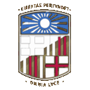 **Universitat de Barcelona**\
<i class="bi bi-calendar3"></i> _2002_\
Barcelona, Spain\
Erasmus interuniversity exchange

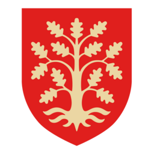 **Møglestu videregående skole**\
<i class="bi bi-calendar3"></i> _1996–1997_\
Lillesand, Norway\
AFS intercultural exchange program

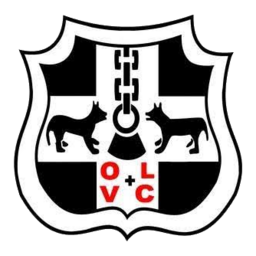 **Onze-Lieve-Vrouwecollege, Antwerp**\
<i class="bi bi-calendar3"></i> _1990–1996_\
Antwerp, Belgium\
Secondary education: mathematics–modern languages
:::


---

## Projects

```{=html}
<div class="pub-list">

<div class="pub-card">
  <a class="pub-thumb" href="https://schaakstudiespinsels2.be/nl/">
    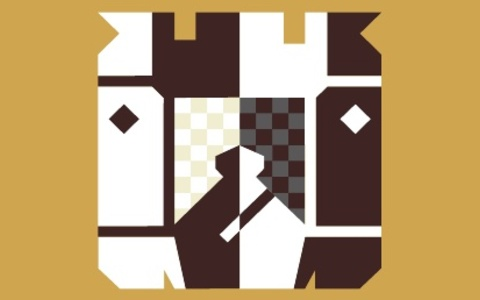
  </a>
  <div class="pub-body">
    <div class="pub-title"><a href="https://schaakstudiespinsels2.be/nl/">SchaakStudieSpinselS 2</a></div>
    <p>More than three hundred chess endgame studies composed by my grandfather, the Flemish study composer Ignace Vandecasteele. I have digitised the second volume of his third book, put the whole collection online, and made the chess boards interactive.</p>
    <div class="pub-badges">
      <a class="badge-primary" href="https://schaakstudiespinsels2.be/nl/"><i class="bi bi-box-arrow-up-right"></i> Live site</a>
      <a href="https://github.com/BioGeek/SchaakStudieSpinsels2"><i class="bi bi-github"></i> Code</a>
      <a href="https://www.lulu.com/shop/ignace-vandecasteele/schaakstudiespinsels-2/paperback/product-14n762rk.html"><i class="bi bi-bag"></i> Buy the book</a>
    </div>
  </div>
</div>

<div class="pub-card">
  <!-- <a class="pub-thumb" href="photography/">
    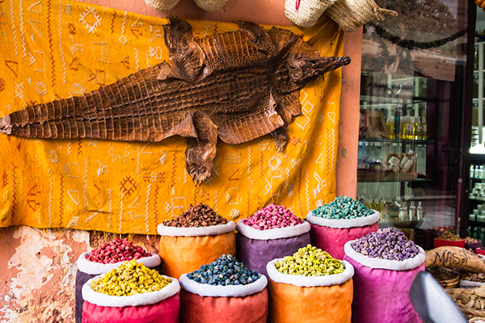
  </a> -->
  <a class="pub-thumb" href="photography/">
    
  </a>
  
  <div class="pub-body">
    <div class="pub-title"><a href="photography/">Photography</a></div>
    <p>My portfolio of portrait, wedding, maternity, boudoir, landscape and long-exposure work.</p>
    <div class="pub-badges">
      <a class="badge-primary" href="photography/"><i class="bi bi-camera"></i> View portfolio</a>
    </div>
  </div>
</div>

<div class="pub-card">
  <a class="pub-thumb" href="https://jeroen.vangoey.be/awesome_de_novo_peptide_sequencing/">
    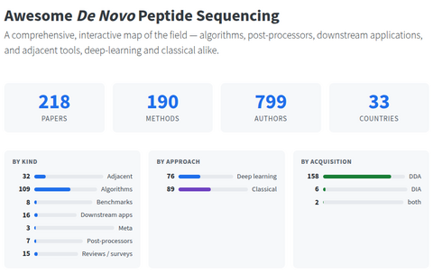
  </a>
  <div class="pub-body">
    <div class="pub-title"><a href="https://jeroen.vangoey.be/awesome_de_novo_peptide_sequencing/">Awesome De Novo Peptide Sequencing</a></div>
    <p>A comprehensive, interactive map of the field: algorithms, post-processors, downstream applications, and adjacent tools, deep-learning and classical alike.</p>
    <div class="pub-badges">
      <a class="badge-primary" href="https://jeroen.vangoey.be/awesome_de_novo_peptide_sequencing/"><i class="bi bi-box-arrow-up-right"></i> Live site</a>
      <a href="https://github.com/BioGeek/awesome_de_novo_peptide_sequencing"><i class="bi bi-github"></i> Code</a>
    </div>
  </div>
</div>

<!-- Hidden for now — work in progress.
<div class="pub-card">
  <a class="pub-thumb" href="projects/self-driving-toy-car.html">
    
  </a>
  <div class="pub-body">
    <div class="pub-title"><a href="projects/self-driving-toy-car.html">Self-driving toy car</a></div>
    <p>Turning a 1/16-scale DonkeyCar into an autonomous car as a hands-on testbed for modern edge ML — training policies in simulation and deploying them to a Jetson Nano and a Coral Edge TPU. An ongoing build, documented as I go.</p>
    <div class="pub-badges">
      <a class="badge-primary" href="projects/self-driving-toy-car.html"><i class="bi bi-car-front"></i> Project overview</a>
      <a href="projects/self-driving-toy-car.html#build-log"><i class="bi bi-journal-text"></i> Build log</a>
    </div>
  </div>
</div>
-->

</div>
```


---

## Hackathons

I have **co-created, organized and judged** machine-learning hackathons at the [Deep Learning Indaba](https://deeplearningindaba.com/) and its regional [IndabaX](https://indabax.co.za/) events.

```{=html}
<div class="pub-list">

<div class="pub-card">
  <a class="pub-thumb" href="https://github.com/BioGeek/hackathon_IndabaX_2025_mlip">
    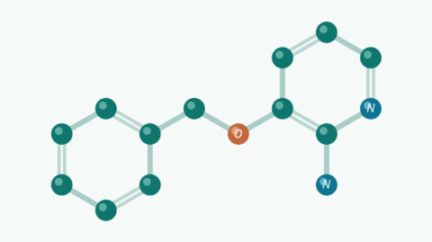
  </a>
  <div class="pub-body">
    <div class="pub-title"><a href="https://github.com/BioGeek/hackathon_IndabaX_2025_mlip">Machine Learning Interatomic Potentials Hackathon</a></div>
    <div class="pub-venue">IndabaX 2025 · Stellenbosch University, South Africa</div>
    <p>Training a Machine Learning Interatomic Potential (MLIP) model (predicting the energy and forces of atomic systems) with the <a href="https://github.com/instadeepai/mlip">mlip</a> library, using the 3BPA molecule (3-(benzyloxy)pyridin-2-amine) as the benchmark system.</p>
    <div class="pub-badges">
      <a href="https://zindi.africa/competitions/indabax-south-africa-2025-hackathon-with-instadeep"><i class="bi bi-trophy"></i> Competition</a>
      <a href="https://github.com/BioGeek/hackathon_IndabaX_2025_mlip"><i class="bi bi-github"></i> Code</a>
      <a href="https://www.linkedin.com/posts/jeroenvangoey_it-was-a-pleasure-hosting-the-hackathon-on-ugcPost-7351611068751720448--NWt/"><i class="bi bi-newspaper"></i> News</a>
    </div>
  </div>
</div>

<div class="pub-card">
  <a class="pub-thumb" href="https://github.com/BioGeek/hackathon_indaba_senegal_2024">
    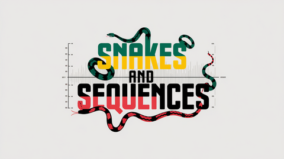
  </a>
  <div class="pub-body">
    <div class="pub-title"><a href="https://github.com/BioGeek/hackathon_indaba_senegal_2024">Snakes and Sequences: Senegalese Serpent Venom Sequencing Hackathon</a></div>
    <div class="pub-venue">Deep Learning Indaba 2024 · Senegal</div>
    <p>Using <a href="https://github.com/instadeepai/InstaNovo">InstaNovo</a> and <i>de novo</i> peptide sequencing to characterise African snake venoms for better antivenoms.</p>
    <div class="pub-badges">
      <a href="https://github.com/BioGeek/hackathon_indaba_senegal_2024"><i class="bi bi-github"></i> Code</a>
      <a href="https://www.linkedin.com/posts/timothy-jenkins-a251ab67_hackathon-ai-deeplearning-ugcPost-7238952177505849344-A7v2/"><i class="bi bi-newspaper"></i> News</a>
    </div>
  </div>
</div>

<div class="pub-card">
  <a class="pub-thumb" href="https://github.com/BioGeek/hackathon_indabaX_2024">
    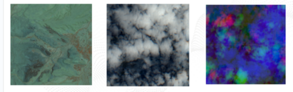
  </a>
  <div class="pub-body">
    <div class="pub-title"><a href="https://github.com/BioGeek/hackathon_indabaX_2024">Desert Locust Breeding Ground Prediction Hackathon</a></div>
    <div class="pub-venue">IndabaX 2024 · University of the Witwatersrand, Johannesburg</div>
    <p>Predicting desert locust breeding grounds from remote-sensing data using <a href="https://github.com/instadeepai/InstaGeo-E2E-Geospatial-ML">InstaGeo</a>, an early-warning task that helps target control efforts before swarms threaten crops and food security across Africa.</p>
    <div class="pub-badges">
      <a href="https://github.com/BioGeek/hackathon_indabaX_2024"><i class="bi bi-github"></i> Code</a>
      <a href="https://www.linkedin.com/posts/jeroenvangoey_it-was-a-pleasure-hosting-a-hackathon-around-ugcPost-7218010024059543552-G4mL/"><i class="bi bi-newspaper"></i> News</a>
    </div>
  </div>
</div>

<div class="pub-card">
  <a class="pub-thumb" href="https://zindi.africa/competitions/dli-ghana-2023">
    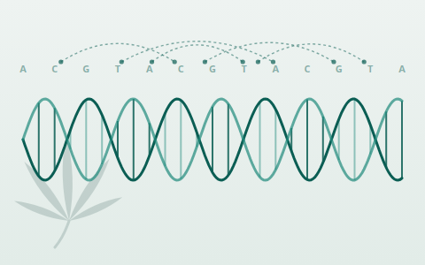
  </a>
  <div class="pub-body">
    <div class="pub-title"><a href="https://zindi.africa/competitions/dli-ghana-2023">Unveiling Cassava's Secrets</a></div>
    <div class="pub-venue">Deep Learning Indaba 2023 · Ghana</div>
    <p>Probe the genome of cassava, a staple crop for food security across Africa, using <a href="https://www.nature.com/articles/s42003-024-06465-2">AgroNT<a/>, a variant of InstaDeep's <a href="https://www.nature.com/articles/s41592-024-02523-z">Nucleotide Transformer</a> trained on edible plant genomes.</p>
    <div class="pub-badges">
      <a href="https://zindi.africa/competitions/dli-ghana-2023"><i class="bi bi-trophy"></i> Competition</a>
      <a href="https://www.linkedin.com/posts/deeplearningindaba-ai-machinelearning-share-7105142248584986624-PsXY/"><i class="bi bi-newspaper"></i> News</a>
      <a href="https://www.linkedin.com/posts/announcing-the-winners-of-our-deep-learning-share-7106612776344698880-nobU/"><i class="bi bi-award"></i> Winners</a>
    </div>
  </div>
</div>

</div>
```


---

## Teaching & mentoring

**Machine Learning for Biology practical**\
<i class="bi bi-calendar3"></i> _2023_\
Deep Learning Indaba, Ghana\
Mentored the hands-on practical alongside InstaDeep and Google DeepMind colleagues.

<div class="pub-badges">
  <a href="https://github.com/BioGeek/indaba-pracs-2023/blob/main/practicals/ML_for_Bio_Indaba_Practical_2023.ipynb"><i class="bi bi-github"></i> Code</a>
  <a href="https://www.linkedin.com/posts/yousra-farhani-7a416219a_machinelearning-biology-dli23-ugcPost-7109547765549936640-Y4t3/"><i class="bi bi-newspaper"></i> News</a>
</div>

**Scientific Python training & mentoring**\
<i class="bi bi-calendar3"></i> _2018–2020_\
BASF and Bayer Crop Science, Belgium\
Trained and mentored researchers and data scientists in scientific Python (NumPy, pandas, BioPython, …) as manager of the Python/R analysis platform used across the company's internal research community.

---

## Skills

**Machine learning**\
<i class="bi bi-diagram-3 skill-glyph" aria-hidden="true"></i>Transformers, diffusion models, large language models (LLMs), supervised & self-supervised learning

**Frameworks**\
PyTorch, TensorFlow / TFX, NumPy, pandas

**MLOps**\
Kubernetes-based ML platforms ([AIchor](https://aichor.ai/)), Docker, CI/CD, workflow orchestration (Airflow, Dagster), experiment tracking (MLflow, Neptune, TensorBoard)

**Cloud**\
Buckets, VMs, Cloud Run (AWS, GCP)

**Scale**\
<i class="bi bi-gpu-card skill-glyph" aria-hidden="true"></i>Distributed GPU training, HPC clusters (InstaDeep's [Kyber](https://instadeep.com/2024/10/instadeep-unveils-near-exascale-supercomputer-kyber-boosting-ai-capabilities/) and EuroHPC's [MareNostrum 5](https://www.bsc.es/marenostrum/marenostrum-5))

**Bioinformatics**\
<svg class="skill-glyph" xmlns="http://www.w3.org/2000/svg" viewBox="0 0 24 24" fill="none" stroke="currentColor" stroke-width="2" stroke-linecap="round" stroke-linejoin="round" aria-hidden="true"><path d="M17 3v1c-.01 3.352 -1.68 6.023 -5.008 8.014c-3.328 1.99 3.336 -2 .008 -.014c-3.328 1.99 -5 4.662 -5.008 8.014v1"/><path d="M17 21.014v-1c-.01 -3.352 -1.68 -6.023 -5.008 -8.014c-3.328 -1.99 3.336 2 .008 .014c-3.328 -1.991 -5 -4.662 -5.008 -8.014v-1"/><path d="M7 4h10"/><path d="M7 20h10"/><path d="M8 8h8"/><path d="M8 16h8"/></svg>BioPython, BLAST, ClustalW, Snakemake, BioNumerics

**Programming languages**\
Python (primary), R

**Spoken languages**\
<i class="bi bi-translate skill-glyph" aria-hidden="true"></i>Dutch (native), English, French &amp; Norwegian (full professional), German &amp; Spanish (notions)

### Just for fun

```{=html}
<div class="pub-list">

<div class="pub-card">
  <a class="pub-thumb" href="https://github.com/BioGeek/euler"></a>
  <div class="pub-body">
    <div class="pub-title">Project Euler</div>
    <p>My solutions to <a href="https://projecteuler.net/">Project Euler</a>, a series of challenging mathematical and computer-programming problems.</p>
    <div class="pub-badges">
      <a class="badge-primary" href="https://github.com/BioGeek/euler"><i class="bi bi-github"></i> Code</a>
    </div>
  </div>
</div>

<div class="pub-card">
  <div class="pub-thumb pub-thumb-wide">
    <table class="aoc-table">
      <thead><tr><th>Year</th><th>Days</th><th>Stars</th></tr></thead>
      <tbody>
      <!-- AOC:ROWS:START -->
      <tr><td>2024</td><td></td><td></td></tr>
      <tr><td>2023</td><td></td><td></td></tr>
      <tr><td>2022</td><td></td><td></td></tr>
      <tr><td>2021</td><td></td><td></td></tr>
      <tr><td>2020</td><td></td><td></td></tr>
      <tr><td>2019</td><td></td><td></td></tr>
      <tr><td>2018</td><td></td><td></td></tr>
      <tr><td>2017</td><td></td><td></td></tr>
      <tr><td>2016</td><td></td><td></td></tr>
      <tr><td>2015</td><td></td><td></td></tr>
      <!-- AOC:ROWS:END -->
      </tbody>
    </table>
  </div>
  <div class="pub-body">
    <div class="pub-title">Advent of Code</div>
    <p>My solutions to <a href="https://adventofcode.com/">Advent of Code</a>, the annual December programming-puzzle event (<!-- AOC:SUMMARY:START -->156 stars across 2015–2024<!-- AOC:SUMMARY:END -->).</p>
    <div class="pub-badges">
      <a class="badge-primary" href="https://github.com/BioGeek/adventofcode"><i class="bi bi-github"></i> Code</a>
    </div>
  </div>
</div>

</div>
```

```{=html}
<div class="social-links footer-social">
  <a href="https://github.com/BioGeek"><i class="bi bi-github"></i> GitHub</a>
  <a href="https://bsky.app/profile/jeroen.vangoey.be"><i class="bi bi-cloud"></i> Bluesky</a>
  <a href="https://x.com/BioGeek"><i class="bi bi-twitter-x"></i> Twitter/X</a>
  <a href="https://orcid.org/0000-0003-4480-5567"><svg viewBox="0 0 256 256" width="1em" height="1em" fill="currentColor" style="vertical-align:-0.125em" aria-hidden="true" focusable="false"><path fill-rule="evenodd" d="M256 128c0 70.7-57.3 128-128 128S0 198.7 0 128 57.3 0 128 0s128 57.3 128 128zM86.3 186.2H70.9V79.1h15.4v107.1zM108.9 79.1h41.6c39.6 0 57 28.3 57 53.6 0 27.5-21.5 53.6-56.8 53.6h-41.8V79.1zm15.4 93.3h24.5c34.9 0 42.9-26.5 42.9-39.7 0-21.5-13.7-39.7-43.7-39.7h-23.7v79.4zM88.7 56.8c0 5.5-4.5 10.1-10.1 10.1s-10.1-4.6-10.1-10.1c0-5.6 4.5-10.1 10.1-10.1s10.1 4.6 10.1 10.1z"/></svg> ORCID</a>
</div>
```

::: {.genome-hacker}
Just another genome hacker. 🧬
:::
