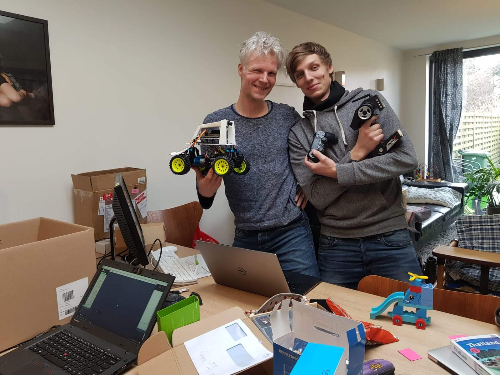
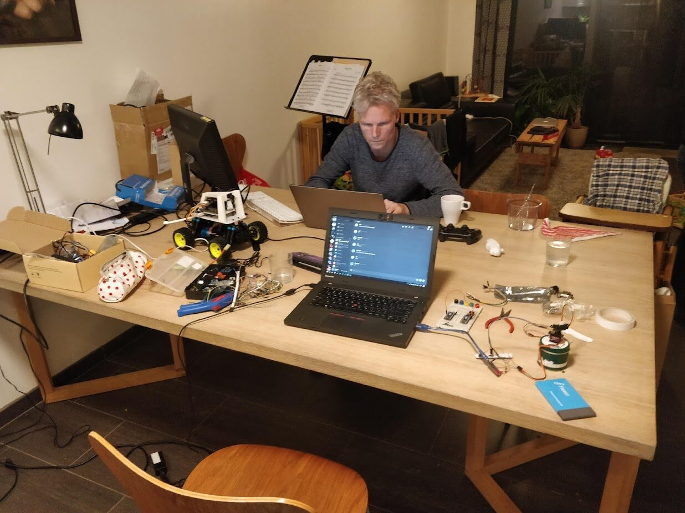

This is a warts-and-all build log of getting a [DonkeyCar](https://docs.donkeycar.com/)
running on a Jetson Nano in an afternoon. Almost nothing went smoothly, and that's
exactly why it's worth writing down — every roadblock below cost real time, and the
fix is the kind of thing you only find by reading kernel logs.

The full parts list — and where this whole project is going — lives on the
[project overview](../../projects/self-driving-toy-car.html#the-hardware). In short:
a Jetson Nano 4 GB drives an RC chassis through a PCA9685 PWM board, with an IMX219
CSI camera as the only sensor and a training PC doing the heavy lifting off-board.

## Why the software stack is frozen in 2021

The original Jetson Nano is **end-of-life**. NVIDIA's last image for it is **<span class="term-tip" tabindex="0" role="note" aria-label="NVIDIA's bundled OS image for Jetson boards (Linux plus GPU drivers and CUDA), shipped as one package." data-tip="NVIDIA's bundled OS image for Jetson boards (Linux plus GPU drivers and CUDA), shipped as one package.">JetPack</span>
4.5.1 / 4.6.x** (Ubuntu 18.04, <span class="term-tip" tabindex="0" role="note" aria-label="NVIDIA's platform for running general-purpose computation on the GPU." data-tip="NVIDIA's platform for running general-purpose computation on the GPU.">CUDA</span> 10.2, **Python 3.6**). JetPack 5/6 dropped Nano
support entirely. The whole stack is vertically welded together — the GPU driver,
CUDA, cuDNN and the OS ship as one <span class="term-tip" tabindex="0" role="note" aria-label="The vendor bundle of kernel, drivers and firmware that makes a specific board boot." data-tip="The vendor bundle of kernel, drivers and firmware that makes a specific board boot.">Board Support Package</span> — so you can't just `apt
upgrade` your way to a modern Python or TensorFlow. That forces:

- **JetPack 4.5.1**, Python **3.6**, TensorFlow **2.3.x** (NVIDIA's special Jetson wheels)
- **DonkeyCar 4.5.x** (the last line that runs on Python 3.6)

So the first lesson: on this board you don't *choose* old versions, the chip's ceiling
chooses them for you.

## Roadblock 1 — SSH: "Too many authentication failures"

First contact over SSH died before a password prompt even appeared:

```bash
$ ssh jeroen@192.168.0.5
Received disconnect from 192.168.0.5 port 22:2: Too many authentication failures
Disconnected from 192.168.0.5 port 22
```

This is **not** a wrong password. The client offers every key in your agent, and each
rejected key counts against the server's `MaxAuthTries` (default 6) — so it hits the
limit before reaching password auth. The fix is to stop offering keys:

```bash
ssh -o IdentitiesOnly=yes -o PubkeyAuthentication=no \
    -o PreferredAuthentications=password jeroen@192.168.0.5
```

The durable fix is a dedicated key plus an SSH config entry. Generate one key just for
the car:

```bash
ssh-keygen -t ed25519 -f ~/.ssh/id_ed25519_donkeycar -N "" -C "jeroen@donkeycar-nano"
```

`ssh-copy-id` then hit the *same* "too many failures" wall (it offers all 6 keys before
installing the new one), so it needs the same flags:

```bash
ssh-copy-id -o IdentitiesOnly=yes -o PubkeyAuthentication=no \
  -o PreferredAuthentications=password -i ~/.ssh/id_ed25519_donkeycar.pub jeroen@192.168.0.5
```

## Roadblock 2 — the terminal type the Nano had never heard of

`top`, `nano`, anything full-screen, failed instantly:

```bash
$ top
'xterm-ghostty': unknown terminal type.
```

Ubuntu 18.04's <span class="term-tip" tabindex="0" role="note" aria-label="The database that tells programs how to draw on a given terminal type." data-tip="The database that tells programs how to draw on a given terminal type.">terminfo</span> database predates the [Ghostty](https://ghostty.org/) terminal.
Tell the Nano to use a `TERM` it knows:

```bash
echo 'export TERM=xterm-256color' >> ~/.bashrc
```

## Roadblock 3 — apt lock on first boot

```bash
$ sudo apt-get upgrade -y
E: Could not get lock /var/lib/dpkg/lock-frontend - open (11: Resource temporarily unavailable)
```

`unattended-upgrades` grabs the dpkg lock at boot. Don't force it — wait it out:

```bash
while sudo fuser /var/lib/dpkg/lock-frontend >/dev/null 2>&1; do
  echo "apt is busy, waiting..."; sleep 5
done
sudo apt-get update && sudo apt-get upgrade -y
```

The DonkeyCar dependencies install fine as one command (`apt-get` happily takes a long
list), and `grpcio` then **compiles from source** because there's no <span class="term-tip" tabindex="0" role="note" aria-label="The 64-bit ARM CPU architecture the Jetson uses, so x86 PC binaries do not run on it." data-tip="The 64-bit ARM CPU architecture the Jetson uses, so x86 PC binaries do not run on it.">aarch64</span> / Python
3.6 wheel — expect 10–25 minutes of a spinner that looks frozen but isn't. That's
`gcc` working, not a hang.

## Calibration: finding the PCA9685, then its PWM limits

The steering servo and ESC are driven by a PCA9685 over I²C. First confirm the kernel
sees it:

```bash
$ sudo i2cdetect -y -r 1
     0  1  2  3  4  5  6  7  8  9  a  b  c  d  e  f
40: 40 -- -- -- -- -- -- -- -- -- -- -- -- -- -- --
70: 70 -- -- -- -- -- -- --
```

`40` is the PCA9685's control address (and `70` its all-call). The first scan came up
**empty** — a wiring fault; reseating the I²C leads brought it back. With the board
visible, the DonkeyCar default pins already matched the hardware:

```python
DRIVE_TRAIN_TYPE = "PWM_STEERING_THROTTLE"
PWM_STEERING_THROTTLE = {
    "PWM_STEERING_PIN": "PCA9685.1:40.1",   # steering servo → channel 1
    "PWM_THROTTLE_PIN": "PCA9685.1:40.0",   # ESC → channel 0
}
```

To calibrate interactively over SSH I wrote a tiny helper that sets a single PWM pulse
using DonkeyCar's *own* PCA9685 driver (so it behaves exactly like the real car), and
exploits the fact that the chip **holds** the last value after the script exits:

```python
# cal_set.py
import sys
from donkeycar.parts.actuator import PCA9685
ch, pulse = int(sys.argv[1]), int(sys.argv[2])
PCA9685(ch, address=0x40, busnum=1).set_pulse(pulse)
print("channel %d -> pulse %d" % (ch, pulse))
```

### The "it's not moving" detour

The servo wouldn't budge — but the I²C writes *succeeded*. That combination (commands
accepted, nothing moves) is the textbook sign that the **V+ servo-power rail is dead**.
On a standard build that rail is fed by the **ESC's <span class="term-tip" tabindex="0" role="note" aria-label="Battery Eliminator Circuit — a 5–6 V regulator inside the ESC that powers the servo rail." data-tip="Battery Eliminator Circuit — a 5–6 V regulator inside the ESC that powers the servo rail.">BEC</span>**, which needs the **drive
battery connected and the ESC switched on**. With no battery, the chip happily sends
PWM into an unpowered servo. Battery in, ESC on, and the sweep worked.

Then it's just binary-searching the limits, with a human watching the wheels:

| Setting | Value | Meaning |
|---|---|---|
| `STEERING_LEFT_PWM` | 460 | full left (no servo strain) |
| `STEERING_RIGHT_PWM` | 290 | full right |
| `THROTTLE_FORWARD_PWM` | 430 | gentle max forward (capped from 500) |
| `THROTTLE_STOPPED_PWM` | 370 | ESC armed, motor stopped |
| `THROTTLE_REVERSE_PWM` | 320 | gentle reverse (needs a brake→neutral→reverse "double-tap") |

Validated by loading it back through DonkeyCar's own config loader:

```bash
$ python -c 'import donkeycar as dk; d=dk.load_config("myconfig.py").PWM_STEERING_THROTTLE; \
             print(d["STEERING_LEFT_PWM"], d["THROTTLE_FORWARD_PWM"])'
460 430
```

## Roadblock 4 — the controller the kernel refuses

I'd bought an "off-brand Xbox controller." Plugged in, `dmesg` told a different story:

```text
usb 1-2.3: New USB device found, idVendor=054c, idProduct=05c4
usb 1-2.3: Product: Wireless controller, Manufacturer: Sony Computer Entertainment
sony 0003:054C:05C4.0001: failed to retrieve feature report 0x81 with the DualShock 4 MAC address
sony: probe of 0003:054C:05C4.0001 failed with error -110
```

It's not an Xbox pad at all — it's a **counterfeit DualShock 4**. It *spoofs* a genuine
DS4's USB ID (`054c:05c4`) but doesn't implement **<span class="term-tip" tabindex="0" role="note" aria-label="A specific USB-HID query the kernel sends a DualShock 4 to read its Bluetooth MAC address; counterfeit pads do not implement it." data-tip="A specific USB-HID query the kernel sends a DualShock 4 to read its Bluetooth MAC address; counterfeit pads do not implement it.">feature report 0x81</span>** (the MAC
address) that the kernel's `hid-sony` driver demands. The probe fails with `-110`
(timeout), so no `/dev/input/js0` is ever created — `jstest` just gets:

```bash
$ jstest /dev/input/js0
jstest: No such file or directory
```

The obvious workaround — force it onto the generic HID driver — is **blocked on this
kernel**. `hid-sony` is *built in* (`CONFIG_HID_SONY=y`), so it can't be unloaded or
blacklisted, and a manual bind to `hid-generic` is refused:

```bash
$ echo -n "0003:054C:05C4.0003" | sudo tee /sys/bus/hid/drivers/hid-generic/bind
bind: FAILED   # the HID core won't let hid-generic claim a device a special driver owns
```

**Verdict:** a counterfeit DS4 cannot work on this kernel without rebuilding it without
`CONFIG_HID_SONY`. The lesson — buy a *genuine* Sony DS4, a real Xbox pad (the `xpad`
driver is far more forgiving), or a Logitech F710. For now, the **web controller**
(below) needs no gamepad at all.

{fig-alt="Two people smiling and holding up the assembled DonkeyCar and a black DualShock-style controller; a blue \"DOUBLESHOCK\" retail box sits on the cluttered desk in front of them"}

## Roadblock 5 — the camera that wasn't sending data

The CSI camera was the longest hunt. The sensor's I²C control channel worked — the
driver bound and `/dev/video0` existed — but every capture **segfaulted**:

```bash
$ gst-launch-1.0 nvarguscamerasrc num-buffers=1 ! \
    'video/x-raw(memory:NVMM),width=1280,height=720' ! nvjpegenc ! filesink location=/tmp/camtest.jpg
(Argus) Error EndOfFile: ... Caught SIGSEGV
$ ls -l /tmp/camtest.jpg
-rw-rw-r-- 1 jeroen jeroen 0 ...   # zero bytes
```

The smoking gun was in `dmesg` and the Argus daemon log:

```text
isp 54680000.isp:     TIMEOUT     10000        # ISP waited for frames, got none
nvargus-daemon: CSI_DEBUG_COUNTER_2_0 = 0x00000000   # ZERO bytes received on the CSI bus
```

So: **I²C fine, but zero data on the <span class="term-tip" tabindex="0" role="note" aria-label="The high-speed differential signalling standard used on the CSI camera ribbon's data lanes." data-tip="The high-speed differential signalling standard used on the CSI camera ribbon's data lanes.">MIPI</span>/CSI lanes.** A reboot later it got *worse* —
even the I²C read started failing:

```text
imx219 6-0010: imx219_board_setup: error during i2c read probe (-110)
imx219: probe of 6-0010 failed with error -110
```

That the symptom *changed between boots* is the tell: this is an **intermittent
physical connection**, not software. A useful piece of logic narrowed it down — I²C and
the high-speed data lanes share the same <span class="term-tip" tabindex="0" role="note" aria-label="Flat Flexible Cable (FFC) — the thin flat camera cable; its conductors can crack while still looking fine." data-tip="Flat Flexible Cable (FFC) — the thin flat camera cable; its conductors can crack while still looking fine.">ribbon</span>, so the fact I²C *ever* worked proved
the **orientation was correct**; only the contact was unreliable.

The fix was a careful, full reseat of the ribbon at **both** ends with the latches
firmly closed. Immediately:

```bash
$ dmesg | grep imx219
imx219 6-0010: tegracam sensor driver:imx219_v2.0.6
vi 54080000.vi: subdev imx219 6-0010 bound          # I²C bind clean, no -110

$ gst-launch-1.0 nvarguscamerasrc num-buffers=1 ! \
    'video/x-raw(memory:NVMM),width=1280,height=720' ! nvjpegenc ! filesink location=/tmp/camtest.jpg
GST_ARGUS: Done Success
$ ls -l /tmp/camtest.jpg
-rw-rw-r-- 1 jeroen jeroen 51866 /tmp/camtest.jpg   # a real 51 KB frame
```

A genuine 51 KB JPEG of the room — the camera works. **Moral:** "the ribbon looks
fine" means nothing; CSI ribbons fail intermittently on the data lanes while I²C still
limps along.

While the camera was down, `CAMERA_TYPE = "MOCK"` let everything else (web UI,
actuators) be tested with blank frames — a useful way to keep moving. Once fixed, back
to `CSIC`.

## Roadblock 6 — power gremlins (three of them)

**(a) Reboots under load.** Running `manage.py drive` made the Nano vanish from the
network and reboot. The reflex is "out of memory," but `free -h` showed a 4 GB board
with **~8 GB of swap** and only 359 MB used — *not* <span class="term-tip" tabindex="0" role="note" aria-label="Out Of Memory — when the system exhausts RAM (and swap) and the kernel starts killing processes." data-tip="Out Of Memory — when the system exhausts RAM (and swap) and the kernel starts killing processes.">OOM</span>. It was a **power transient**:
the Nano was in <span class="term-tip" tabindex="0" role="note" aria-label="The Jetson's maximum-performance power mode (all cores, highest clocks, highest current draw)." data-tip="The Jetson's maximum-performance power mode (all cores, highest clocks, highest current draw).">MAXN</span> mode pulling current spikes a marginal supply couldn't hold. A
solid 5 V/4 A barrel supply plus 5 W mode fixed it:

```bash
sudo nvpmodel -m 1     # 5 W mode (MAXN is -m 0) — lower current draw
```

**(b) <span class="term-tip" tabindex="0" role="note" aria-label="USB Power Delivery — a protocol that negotiates higher voltages (9–20 V) over USB-C." data-tip="USB Power Delivery — a protocol that negotiates higher voltages (9–20 V) over USB-C.">USB-PD</span> over-voltage — the scary one.** The power bank's USB-**C** port is
**USB-PD**: it negotiates 9–20 V. Fed into the Nano's 5 V barrel jack via a USB-C-to-DC
cable, the green LED lit for ~10 s, then died as the bank ramped voltage — risking a
fried board. **Rule: only ever use the power bank's plain USB-A (5 V) output for the
barrel jack.** The Nano survived; it was lucky.

**(c) <span class="term-tip" tabindex="0" role="note" aria-label="The protocol a router uses to hand out IP addresses automatically — which is why the Nano's IP can change." data-tip="The protocol a router uses to hand out IP addresses automatically — which is why the Nano's IP can change.">DHCP</span> musical chairs.** After all the reboots, `ssh nano` suddenly connected to…
nothing useful:

```bash
$ ping 192.168.0.5
64 bytes from 192.168.0.5: ttl=64 time=0.026 ms   # loopback speed — that's *this PC*
$ ip -4 addr show | grep 192.168.0.5
inet 192.168.0.5/24 ... wlp0s20f3                 # the laptop grabbed the Nano's old IP
```

DHCP had reassigned `192.168.0.5` to the laptop; the Nano moved to `.4`. The fix is to
stop hard-coding the IP and use <span class="term-tip" tabindex="0" role="note" aria-label="Multicast DNS — lets you reach a device by a .local name without knowing its IP address." data-tip="Multicast DNS — lets you reach a device by a .local name without knowing its IP address.">mDNS</span>:

```bash
$ getent hosts donkeycar.local
192.168.0.4     donkeycar.local
```

…and bake it into `~/.ssh/config` so it follows the Nano forever:

```
Host nano
    HostName donkeycar.local
    User jeroen
    IdentityFile ~/.ssh/id_ed25519_donkeycar
    IdentitiesOnly yes
    StrictHostKeyChecking accept-new
```

## Driving it: the web controller

No gamepad needed — DonkeyCar serves a browser UI:

```bash
cd ~/mycar && python manage.py drive
# → http://donkeycar.local:8887/drive
```

One gotcha cost ten minutes: after a Nano reboot, the **page open on the phone was a
stale tab** pointing at the dead server's <span class="term-tip" tabindex="0" role="note" aria-label="A persistent two-way browser-to-server connection — how the web UI streams your joystick input to the car in real time." data-tip="A persistent two-way browser-to-server connection — how the web UI streams your joystick input to the car in real time.">WebSocket</span>. The clue was server-side:

```bash
$ ss -tn | grep :8887 | grep -v 127.0.0.1
# (empty) — the phone wasn't actually connected
```

A hard refresh re-established the `101 GET /wsDrive` WebSocket upgrade and the wheels
responded.

<video controls preload="none" poster="images/drive-poster.jpg" width="1280" height="720" style="width:100%;height:auto;border-radius:6px;">
  <source src="images/drive.mp4" type="video/mp4">
  Your browser doesn't support embedded video. <a href="images/drive.mp4">Download the clip</a>.
</video>

The payoff: driving it untethered across the floor from a phone — no gamepad, no
tether, just the Nano and the web controller.

## Version control on the edge

The calibration and camera config live in a fork (`BioGeek/mycar`). GitHub no longer
accepts passwords, so it's a Personal Access Token cached once:

```bash
git config credential.helper store   # then enter the PAT once on first push
git checkout -b jeroen_nano          # the repo was in detached HEAD at tag 4.5.1
git push -u fork jeroen_nano
```

{fig-alt="A person working at a laptop late at night at a wooden dining table cluttered with the DonkeyCar, a breadboard, components and a DualShock controller"}

## What's next

The camera works, the car drives, and it runs untethered. The next milestone is the
real point: **record laps → train a <span class="term-tip" tabindex="0" role="note" aria-label="Training a model to imitate recorded human actions — here, mapping camera frames to the steering/throttle you commanded." data-tip="Training a model to imitate recorded human actions — here, mapping camera frames to the steering/throttle you commanded.">behavioural-cloning</span> model on the RTX 4070 → hand
control to the autopilot**:

```bash
python manage.py drive              # record "tubs" of (image, steering, throttle)
donkey train --tub data --model models/pilot.h5   # on the PC, not the Nano
python manage.py drive --model models/pilot.h5
```

…and before training anything, *look at the data* — the steering-angle balance decides
where the car will fail long before the model architecture does. But that's the next
post.

## The transferable lessons

- **Read the kernel log first.** `dmesg` named every real fault here — the counterfeit
  controller (`probe failed -110`), the dead CSI lanes (`CSI_DEBUG_COUNTER = 0`), the
  power resets — while the surface symptoms lied.
- **Distinguish "accepted" from "effective."** I²C writes succeeded into an unpowered
  servo; the camera bound but sent no data. *Acknowledged ≠ working.*
- **On EOL hardware, the chip sets your software ceiling**, not your preferences.
- **Buy genuine peripherals.** A counterfeit DS4 turned into an unwinnable fight with a
  built-in kernel driver.
