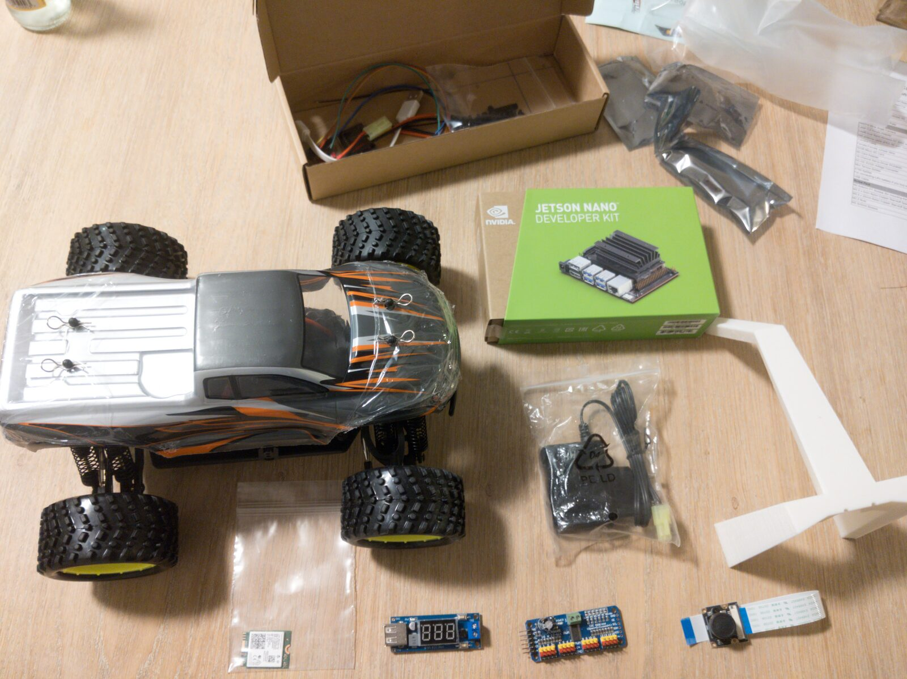
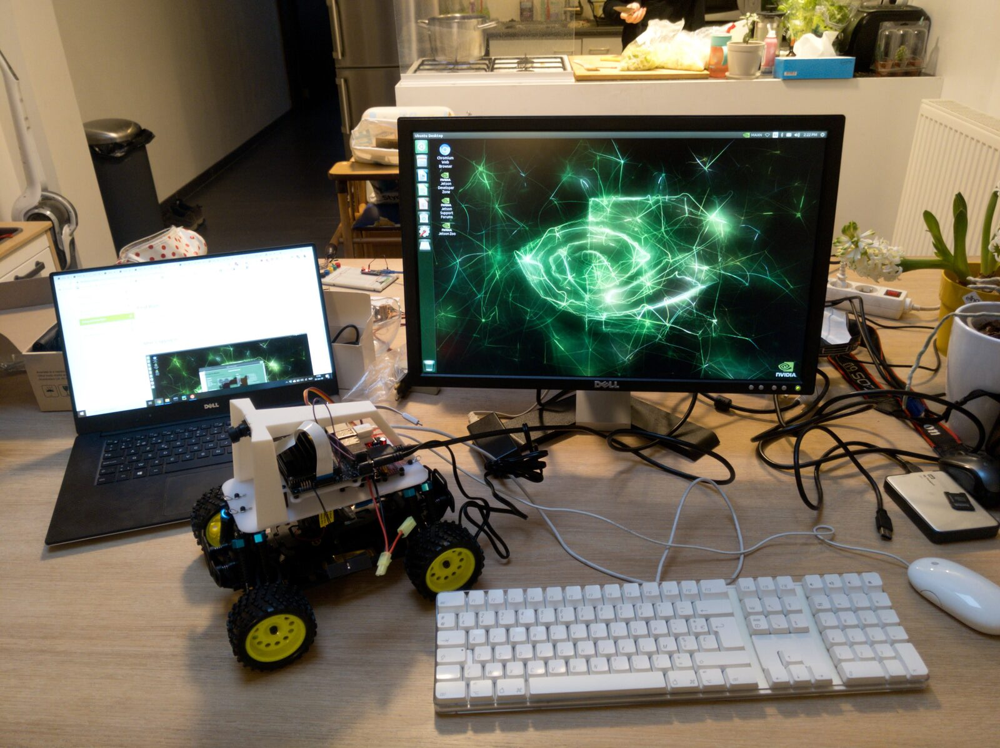

I'm turning a 1/16-scale RC car into a small autonomous vehicle using the [DonkeyCar](https://www.donkeycar.com) platform. In my day job I'm working with transformer and diffusion models, but this project gives me a deliberately constrained playground for the parts of modern ML that I don't get much exposure to: reinforcement learning, sim-to-real transfer, vision-language-action models. It is also my first hardware project.

This page gives an overview of what the car is, how it's put together, and where the
project is going. The [build log](#build-log) below collects the individual posts
on architecture and progress as I write them.

{fig-alt="DonkeyCar parts laid out on a wooden floor — an RC monster-truck chassis with bodyshell, an NVIDIA Jetson Nano Developer Kit box, a PCA9685 PWM driver board, a buck converter, a CSI camera module and a white 3D-printed mounting cage"}

## The hardware

| Part | Role |
|------|------|
| Jetson Nano (4 GB, B01) | On-board inference |
| HSP 94186 RC car chassis + ESC + brushed motor | The vehicle |
| Wide-angle CSI camera (IMX219) | The only sensor the model gets |
| PCA9685 (16-channel PWM driver) | Steering servo + ESC control over I²C |
| TCBWORTH 1800 mAh LiPo | Drive battery (motor + servo rail) |
| RED-E 10 000 mAh power bank | Untethered power for the Nano |
| 3D-printed roll cage + laser-cut acrylic base plate | Mounts the Nano, camera and PWM board to the chassis |

A laptop with a GPU (RTX 4070) sits on the same network for the model training. A
**Coral Edge TPU** is planned but not yet in the build — see the [roadmap](#roadmap).

{fig-alt="An assembled DonkeyCar with a Jetson Nano and camera on a white 3D-printed cage mounted on an RC car chassis. The monitor is plugged into the car and shows the Nano's JetPack desktop, NVIDIA's Ubuntu-based Linux for the Jetson."}

## The architecture

One idea runs through the whole project: a slow brain and fast reflexes, split
across devices. This is the *intended* design — today the car drives from the Nano
alone over the web controller, and the pieces below get built out along the
[roadmap](#roadmap).

- **System 1 — fast reflexes.** A tiny convolutional policy that maps camera frames to steering and throttle, quantized to INT8 for the real-time control loop. The plan is to offload this to a **Coral Edge TPU** (a USB INT8 accelerator) so it runs at high frame rate and low power; for now it would run on the Nano.
- **Host — the Nano.** Camera capture, actuator control over I²C, and the safety/glue layer.
- **System 2 — off-board.** An optional, slower model (a small vision-language-action model, or an LLM planner) that issues high-level intent over wifi at a few hertz, which System 1 then carries out.

The guiding constraint is simple: **train off-device, deploy on-device.** The
Nano's software stack is too old for a modern training toolchain, so learning
happens on a real GPU off-board and the car only ever runs a compiled artifact.

## Roadmap

Roughly most-feasible to most-ambitious. Each step reuses the deployment pipeline
built by the one before it, and each will get its own build-log post.

1. <input type="checkbox" checked disabled> **Hardware audit & baseline** — confirm what each device runs and get teleop working end to end.
2. <input type="checkbox" disabled> **Line following, classic CV** — point the camera forward, threshold + centroid + a P-controller, and drive a loop with no ML. Gets the car physically moving and sets a *baseline lap time*.
3. <input type="checkbox" disabled> **Line following, learned: BC-CNN → Coral** — redo it as a small CNN, quantized to INT8 and compiled for the Coral. This commissions the train → quantize → compile → deploy pipeline, and — seeing *ahead* — should beat the CV lap time.
4. <input type="checkbox" disabled> **LLM as an offline copilot** — use a large model off-line to design reward functions, generate track curricula, and analyse failure logs.
5. <input type="checkbox" disabled> **Sim RL with PufferLib** — train a policy in `gym-donkeycar` with PPO (pure Python), then distil and deploy.
6. <input type="checkbox" disabled> **High-throughput RL in JAX** — a fast custom driving env, GPU-vectorized, trained in minutes, transferred with domain randomization.
7. <input type="checkbox" disabled> **Dual-system "talk to your car"** — an off-board vision-language-action model issuing intent, the Coral handling control.
8. <input type="checkbox" disabled> **Dream-to-drive** — a JAX world model, training the policy in imagination.

## Build log {#build-log}

Posts on architecture and progress, oldest first. (More to come — this fills in
as the roadmap above gets built.)

::: {#buildlog-posts}
:::
